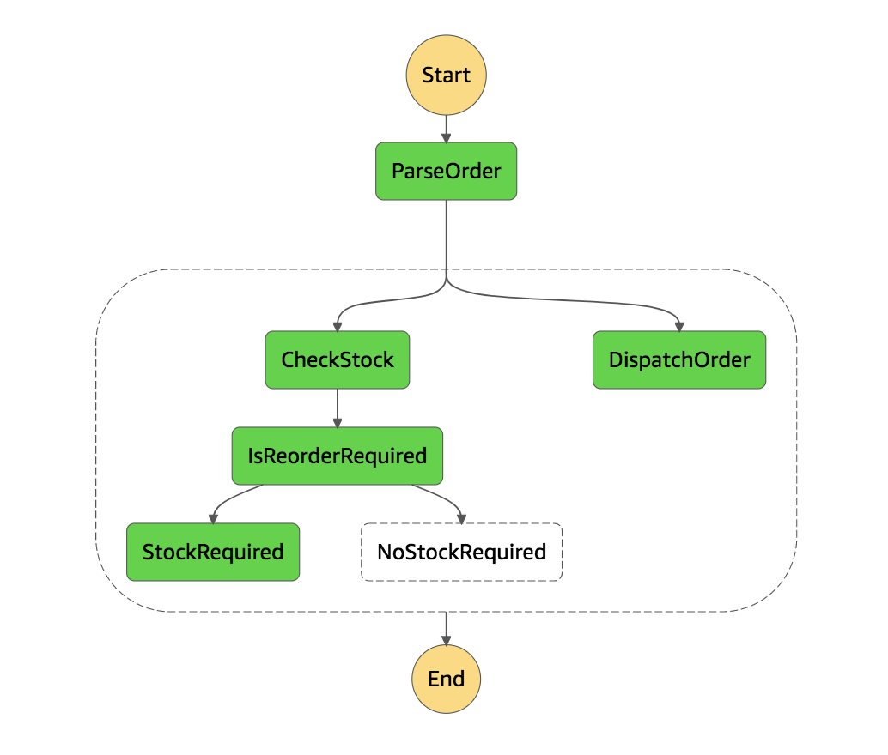

# Serverless Shop

Basic ecommerce with AWS Step Functions, Lamda, API Gateway and GraphQL using [serverless](https://serverless.com).

## Installation

```
# Install serverless globally  
npm i -g serverless

# Install dependencies  
npm i
```

## Deployment to AWS

```
sls deploy
```

## Usage

### View products

`curl -X POST -d '{ products { name, quantity } }' $DEPLOYED_URL/graphql`

### Purchase a product

`curl -X POST -d '{"productId": "1","customerId": "ABC123"}' $DEPLOYED_URL/purchase`

### Working example

Screenshot of the flow of purchasing a product in the step functions visualiser.  
If the stock for an item goes below 5, it orders more stock.  

